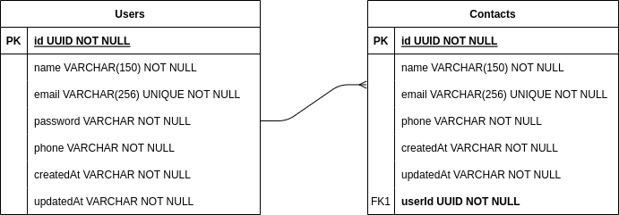

# API documentation

## Table of Contents

- [Overview](#1-overview)
- [ER Diagram](#2-er-diagram)
- [Quick Start](#3-quick-start)
  - [Clone repository](#31-clone-this-repository)
  - [Configure .env](#32-configure-env)
  - [Install the dependencies](#33-install-the-dependencies)
  - [Run the migrations](#34-run-the-migrations)
  - [Run the project](#35-run-the-project)
- [Quick Start Using Docker](#4-quick-start-using-docker)
  - [Clone repository](#41-clone-this-repository)
  - [Configure .env](#42-configure-env)
  - [Install the dependencies](#43-install-the-dependencies)
  - [Settings for running docker](#44-settings-for-running-docker)
- [Endpoints](#5-endpoints)

---

## 1. Overview

A simple api for the registration of users and contacts, some of the technologies used.

- [NodeJS](https://nodejs.org/en/)
- [Express](https://expressjs.com/pt-br/)
- [TypeScript](https://www.typescriptlang.org/)
- [PostgreSQL](https://www.postgresql.org/)
- [TypeORM](https://typeorm.io/)
- [Yup](https://www.npmjs.com/package/yup)

---

## 2. ER Diagram

[Back to the top](#table-of-contents)

ER diagram of the API defining well the relationships between the database tables.



---

## 3. Quick Start

[Back to the top](#table-of-contents)

### 3.1 Clone this repository

```shell
git clone https://github.com/schillreff/user-contacts-backend.git
cd user-contacts-backend
```

### 3.2 Configure .env

```text
Create an .env file in the project root, copy the contents of .env.example and add the database name, user and password information
```

### 3.3 Install the dependencies

```shell
yarn install
```

### 3.4 Run the migrations

```shell
yarn typeorm migration:run -d src/data-source
```

### 3.5 Run the project

```shell
yarn dev
```

---

## 4 Quick Start Using Docker

[Back to the top](#table-of-contents)

### 4.1 Clone this repository

```shell
git clone https://github.com/schillreff/user-contacts-backend.git
cd user-contacts-backend
```

### 4.2 Configure .env

```text
Create an .env file in the project root, copy the contents of .env.example and add the database name, user and password information
```

### 4.3 Install the dependencies

```shell
yarn install
```

### 4.4 Settings for running docker

1. To start and restart all services defined in docker-compose.yml

    ```shell
    docker-compose up
    ```

    ```shell
    sudo docker-compose up
    ```

2. To stop all services defined in docker-compose.yml

    ```shell
    docker-compose stop
    ```

    ```shell
    sudo docker-compose stop
    ```

3. To restart the previously stopped containers

    ```shell
    docker-compose start
    ```

    ```shell
    sudo docker-compose start
    ```

4. To stop container execution, and will remove stopped containers

    ```shell
    docker-compose down
    ```

    ```shell
    sudo docker-compose down
    ```

---

## 5 Endpoints

[Back to the top](#table-of-contents)

### 5.1 <http://127.0.0.1:3001/login>, login

### 5.2 <http://127.0.0.1:3001/user>, CRUD user

### 5.3 <http://127.0.0.1:3001/contact>, CRUD contact
